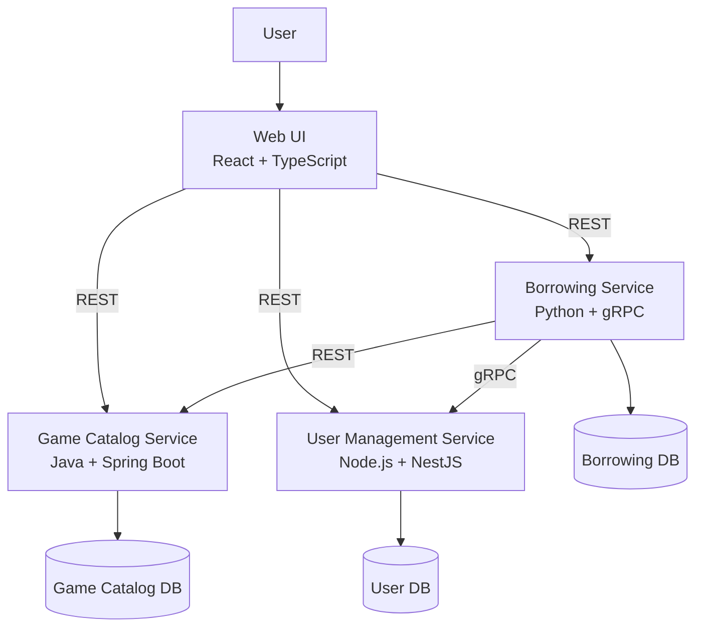

# Board Game Lending System

## Opis projekta

Board Game Lending System je mikrostoritveni sistem za izposojo družabnih iger.

Uporabnikom omogoča pregled družabnih iger, preverjanje njihove razpoložljivosti, izposojo in vračilo iger prek spletne aplikacije.

## Glavne funkcionalnosti

- pregled družabnih iger
- pregled podrobnosti igre
- preverjanje razpoložljivosti
- izposoja igre
- vračilo igre
- pregled zgodovine izposoj
- upravljanje uporabnikov


## Mikrostoritve

### Game Catalog Service

Skrbi za upravljanje družabnih iger, kategorij, števila igralcev, težavnosti in razpoložljivosti.

### Borrowing Service

Skrbi za izposojo, vračilo in zgodovino izposoj družabnih iger.

### User Management Service

Skrbi za uporabnike, njihov status in omejitve izposoje.

### Web UI

Spletna aplikacija, prek katere uporabnik dostopa do sistema.

## API Gateway / BFF

Sistem uporablja vzorec »Backend for Frontend« (BFF).

Implementirana sta dva ločena vmesnika BFF:

### web-BFF

Tehnologija: Node.js + Express

Vrata (port): 4000

Spletni BFF zagotavlja končne točke (endpoints), optimizirane za spletni odjemalec.

Primeri:

- GET /games
- GET /games/{id}
- GET /users
- GET /users/{id}
- POST /users
- POST /borrowings
- PUT /borrowings/{id}/return
- GET /users/{id}/borrowings

### mobile-BFF

Tehnologija: Python + FastAPI

Vrata (port): 4001

Mobilni BFF zagotavlja manjši API, optimiziran za mobilne odjemalce.

Primeri:

- GET /mobile/games
- GET /mobile/games/{id}
- GET /mobile/users/{id}
- GET /mobile/users/{id}/borrowings

Vmesnika BFF zagotavljata enotno vstopno točko za ustrezne odjemalce in skrivata notranjo arhitekturo mikrostoritev.


                         ┌─────────────────┐
                         │   Web Client    │
                         └────────┬────────┘
                                  │
                                  ▼
                         ┌─────────────────┐
                         │     Web BFF     │
                         │ Node.js/Express │
                         │      :4000      │
                         └────────┬────────┘
                                  │
          ┌───────────────────────┼───────────────────────┐
          │                       │                       │
          ▼                       ▼                       ▼
    Game Catalog          User Management            Borrowing
       :8081                    :3000                  :50051
       REST                     REST                    gRPC


                         ┌─────────────────┐
                         │  Mobile Client  │
                         └────────┬────────┘
                                  │
                                  ▼
                         ┌─────────────────┐
                         │   Mobile BFF    │
                         │ Python/FastAPI  │
                         │      :4001      │
                         └────────┬────────┘
                                  │
          ┌───────────────────────┼───────────────────────┐
          │                       │                       │
          ▼                       ▼                       ▼
    Game Catalog          User Management            Borrowing
       :8081                    :3000                  :50051
       REST                     REST                    gRPC

## Lastništvo podatkov

| Storitev | Podatki |
|---|---|
| Game Catalog | Igre, kategorije, težavnost, število igralcev |
| Borrowing | Izposoje, vračila, zgodovina |
| User Management | Uporabniki, status, omejitve izposoje |


## Tehnologije


| Component        | Technology         |
| ---------------- | ------------------ |
| Game Catalog     | Java + Spring Boot |
| Borrowing        | Python + gRPC      |
| User Management  | Node.js + NestJS   |
| Web UI           | React + TypeScript |
| Databases        | PostgreSQL         |
| Containerization | Docker             |


## Komunikacija med storitvami


                 Web UI
                   |
          ┌────────┼────────┐
          |        |        |
        REST     REST     REST
          ↓        ↓        ↓
       Catalog  Borrowing  Users
                  |   |
                REST gRPC
                  ↓   ↓
               Catalog Users


## Arhitektura sistema





## Struktura repozitorija

    board-game-lending-system/
    ├── README.md
    ├── .gitignore
    ├── docs/
    ├── game-catalog-service/
    ├── borrowing-service/
    ├── user-management-service/
    └── web-ui/


docker compose build --no-cache activemq

### Zagon

```bash
docker compose up --build